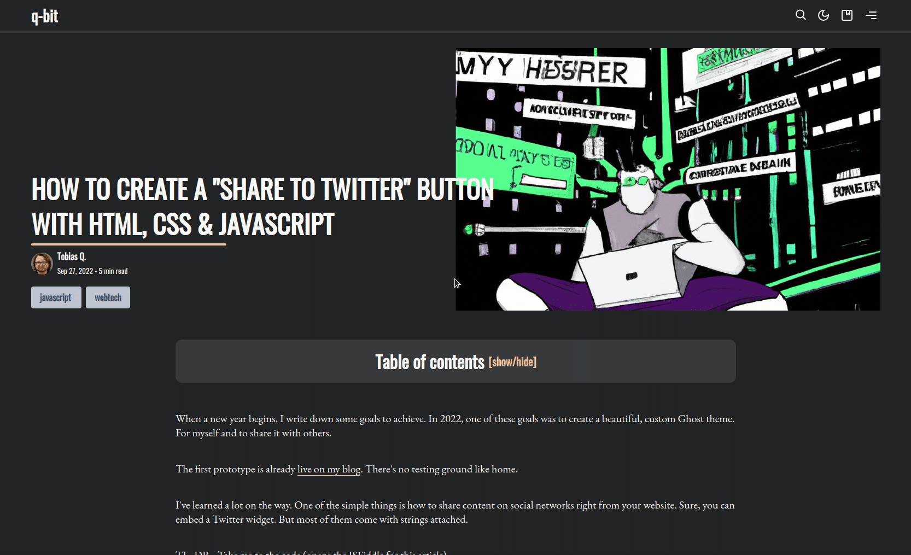
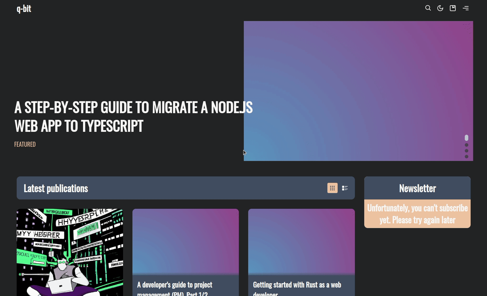

# Bookmarking posts

If your readers cannot finish an article in a single go, they can simply add a bookmark and continue reading later. Candidus will even save the paragraph where users stopped reading and scroll it back into view.

:::info
This feature is **disabled** by default.
:::

## Activate this feature

This feature can be enabled in your Ghost design settings under

<ClientOnly> <SiteOutput path="ghost/#/settings/design" /> </ClientOnly> `> Posts > Enable bookmarks`

:::warning SUPPORTED DEVICES
This feature is currently only availabe on desktop devices. Please note that a bookmark is only available in the same browser and on the same device where it has been initially saved.
:::

## How does it work?

When a user selects text from an article, a small toolbar opens. When they click on the first icon on the left side, a reference of the article and the selected paragraph will be stored in the reader's browser.

:::danger CLEARING THE BROWSER CACHE
Under the hood, Candidus uses a browser feature called `localstorage`. This means: When a user clears the browser's cache, their bookmarks will also be lost.
:::

At the same time, a small icon will appear to the left side of the paragraph that has been bookmarked. It can be clicked to remove the bookmark again.

If a user now leaves your publication and comes back at a later point, they can use the `bookmark` button in the upper navbar and are taken back to the paragraph where they stopped reading.

