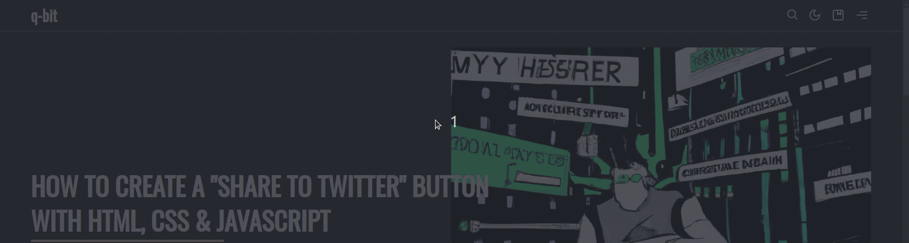

# Reading progress bar

Show users how much of your article they've already read by activating a progressbar right above the posts's content. This type of progress indicator is popular on technical- or review blogs with longer and more detailled content.

:::info
This feature is **disabled** by default.
:::

## Activate this feature

This feature can be enabled in your Ghost design settings under

<SiteOutput path="ghost/#/settings/design" /> `> Posts > Enable post reading progress bar`

## How does it work?

The progress indicator uses Javascript to calculate how much of the post's content is scrolled above half the screen-size. If you have 'Related Posts' disabled and not many footer links or tags, it's possible for the indicator to never show a progress of 100%. If that's the case, you should disable it for now and enable it once you've added more content.

In the image below, you can see the progress indicator increasing and decreasing in width, depending on the scroll position of the reader.

