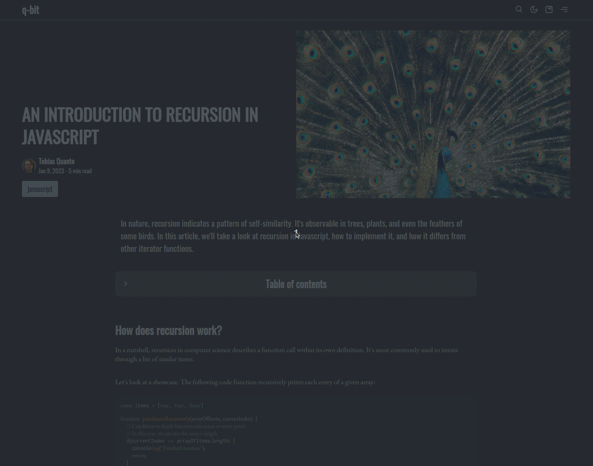

# Table of contents

Give your readers an overview of your post by adding a table of contents (TOC) below your excerpt. The TOC can be toggled and allows readers to quickly navigate through your content.

:::info
This feature is **disabled** by default.

-> If enabled, the 'Share this post' - toolbar will be moved to the bottom of the page
:::

## Activate this feature

This feature can be enabled in your Ghost design settings under

<ClientOnly> <SiteOutput path="ghost/#/settings/design" /></ClientOnly>  `> Posts > Enable table of contents`

## How does it work?

This feature queries all `h2` and `h3` tags that are part of your post. It extracts the heading text and indexes it before rendering the related TOC - item. TOC also adds a convenience functionality - when clicking on a headline with the mouse, it will scroll until the clicked element is at the top of the viewport.

