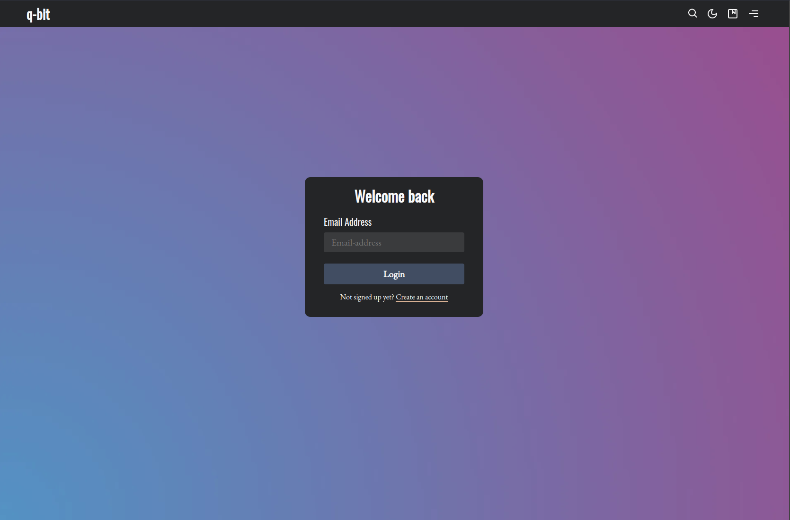
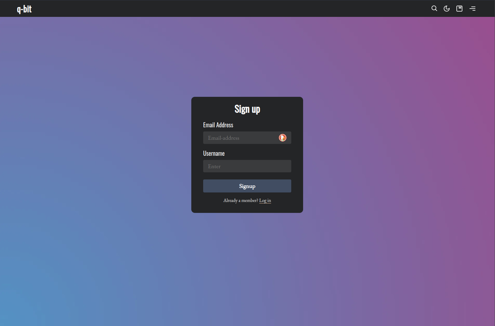

<script setup>
  import SiteOutput from '../../../components/SiteOutput.vue'
  import Grid from '../../../components/Grid.vue';
</script>

# Login & Signup pages

Candidus ships with two static member-focused pages. They differ from [the default Ghost pages](https://ghost.org/docs/publishing/#pages) insofar as they're shipped with the theme. All you have to do is to **create** an empty page with the right name and you're done.

- [Example: preview image login page](#login-page)
- [Example: preview image signup page](#signup-page)


## Activate this feature

In order to use static login & signup pages, you have to follow these steps:

1. Enable the ghost feature for `memberships`
2. Create an empty page named `login`
3. Create an empty page named `signup`
4.  Add a custom background image
5. Overwrite sidebar navigation (optional)

## 1. Enable memberships

You can enable memberships in your settings. Select one of the following `Subscription access` options to get started:

- Anyone can sign up
- Only people I invite

Link: <SiteOutput path="ghost/#/settings/members" />

## 2. Create the login page

Create a new page with the exact name of `login` under your publication's pages. Publish it. It must not have any other content but the headline.

Add the page here: <SiteOutput path="ghost/#/pages" />

:::tip
You can check if the page creation was successful by visiting <SiteOutput path="login" />
:::

## 3. Create the signup page

Create a new page with the exact name of `signup` under your publication's pages:   Publish it. It must not have any other content but the headline.
 publication's pages. Publish it. It must not have any other content but the headline.

Add the page here: <SiteOutput path="ghost/#/pages" />

:::tip
You can check if the page creation was successful by visiting <SiteOutput path="signup" />
:::

## 4. Use a custom member form image

Candidus allows you to add your own background image to both of these pages. If you do not specify one, the publication cover will be used by default.

To change the image, go to <SiteOutput path="ghost/#/settings/design" /> `> Site-wide > Member form image`. Click on `Upload` and select an image of your liking.


## 5. Overwrite sidebar navigation (optional)

Now that you have both member pages available, you might want to overwrite the 'Sign up' and 'Log in' - buttons of your sidebar navigation.

By default, these buttons will activate the built-in Ghost 'Portal' - feature and open a modal rather than directing to the member pages. You can overwrite this behavior by going into your design settings under <SiteOutput path="ghost/#/settings/design" /> `> Site-wide > Use static member pages`. Once this is done, 'Sign up' and 'Login' will direct a user to the respective pages.

Alternatively, you can add the respective links into your page's secondary navigation: <SiteOutput path="ghost/#/settings/navigation" />

## How does it work?

Static pages are built into Ghost's core. Candidus ships with two pre-built, custom pages. The documentation on these is rather light - they were mentioned in a blog post from version 0.4.2. -> [Check it out here](https://ghost.org/changelog/new-for-themes-0-4-2/#custompagetemplates).

By creating a static page with the same name as the custom page, Ghost maps these two together. When a user visits your site, Ghost will pick up the custom page template rather than the empty static page.

:::important
For this to work, the static page must have the exact same name as the custom page
:::

The custom login & signup pages still use the Ghost Portal features under the hood. Instead of opening a modal, they use custom [Signup Forms](https://ghost.org/docs/themes/members/#signup-forms) to authorize a user.

As for the sidebar overwrite - I am using a simple if-else helper to map either the `data-portal` property or a `href` to the respective form page:

```hbs | Expanded for easier readablity
<a tabindex='-1' class='px-4 py-2'
  {{#if @custom.use_static_member_pages}}
    href='/signup'
  {{else}}
    href="#" data-portal="signup"
  {{/if}}
  >Sign up</a>
```

### Login page



### Signup page

