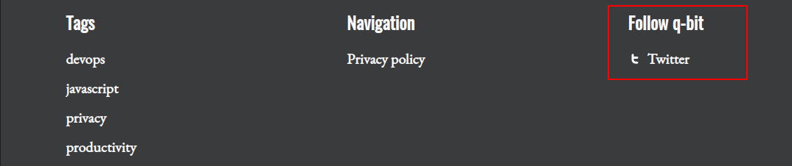

<script setup>
  import SocialIcons from '../../components/Socialicons.vue'
  import SiteOutput from '../../components/SiteOutput.vue'
</script>

# Social Icons and profiles

Ghost ships with a few default social media profiles, like Twitter and Facebook. While these are usually sufficient to satisfy SEO best practices, you might want to add more of your social media presence to your publication.

There are a few ways to do this in other themes:

- You can use [Ghost's Code Injection](https://ghost.org/changelog/post-code-injection/) to dynamically add social media items
- You can maintain additional profiles using [Ghost's secondary navigation](https://ghost.org/help/updating-navigation/)

Candidus uses a mix of both of these approaches, without making you use your secondary navigation, to add your profiles and icons.

## Add social icons to your profiles

Social profiles with icons can be embedded using Code Injection. Candidus also ships with a selection of [Simpleicons](https://simpleicons.org/), a project published under an [Open Source License](https://github.com/simple-icons/simple-icons/blob/develop/LICENSE.md).

Each profile can be added using Candidus' Plugin System. The generic structure looks like this:

```html
<script>
window.CANDIDUS = {
  SOCIAL_ACCOUNTS: [
    {
      title: "<label-next-to-the-icon>", // e.g. 'Github', 'Reddit', 'Pinterest'
      slug: "<link-to-the-icon>", // e.g. 'github', 'reddit', 'pinterest'
      url: "<link-to-your-profile>" // e.g. 'https://github.com'
    },
    { /* Another social account */}
  ]
}
</script>
```

Check out the examples to get learn more about added profiles with icons.

## Example: Add your Github Profile

Candidus shows your social media profiles in the page's footer, next to tags and secondary navigation.



To add your Github Profile, just add the following piece of code into your page's code injection:

<ClientOnly> <SiteOutput path="ghost/#/settings/code-injection" /> </ClientOnly>

```html
<script>
window.CANDIDUS = {
  SOCIAL_ACCOUNTS: [
    {
      title: "Github",
      slug: "github",
      url: "https://github.com/tq-bit"
    }
  ]
}
</script>
```

Then, change the following attributes to point to your Profile:

- title: The label next to your icon
- slug: The ID by which the icon is recognized (See [Icons Overview](#icons-overview) for a full reference)
- url: The website to which your profile should link


## Example: Add your Instagram Profile

Let's do another one. Let's assume that next to your Github profile, you'll also want to refer to Insta.

Move to Code Injection again and extend the `SOCIAL_ACCOUNT` from before like this:


<ClientOnly> <SiteOutput path="ghost/#/settings/code-injection" /></ClientOnly>

```html {9-13}
<script>
window.CANDIDUS = {
  SOCIAL_ACCOUNTS: [
    {
      title: "Github",
      slug: "github",
      url: "https://github.com/tq-bit"
    }, // <- don't forget the comma!
    {
      title: "Instagram",
      slug: 'instagram',
      url: "https://instagram.com"
    }
  ]
}
</script>
```

Check our your front page and - here it is:


## Icons overview

The following social icons are available to use in your theme:
<SocialIcons/>

<div class="icon-wrapper">
<svg class="icon" width='24px' height='24px' role='img'>
    <use  xlink:href='#facebook'></use>
</svg> <span class="icon-title">Facebook via <pre>#facebook</pre></span>
</div>
<div class="icon-wrapper">
<svg class="icon" width='24px' height='24px' role='img'>
    <use xlink:href='#twitter'></use>
</svg> <span class="icon-title">Twitter via <pre>#twitter</pre></span>
</div>
<div class="icon-wrapper">
<svg class="icon" width='24px' height='24px' role='img'>
    <use xlink:href='#instagram'></use>
</svg> <span class="icon-title">Instagram via <pre>#instagram</pre></span>
</div>
<div class="icon-wrapper">
<svg class="icon" width='24px' height='24px' role='img'>
    <use xlink:href='#linkedin'></use>
</svg> <span class="icon-title">Linkedin via <pre>#linkedin</pre></span>
</div>
<div class="icon-wrapper">
<svg class="icon" width='24px' height='24px' role='img'>
    <use xlink:href='#youtube'></use>
</svg> <span class="icon-title">Youtube via <pre>#youtube</pre></span>
</div>
<div class="icon-wrapper">
<svg class="icon" width='24px' height='24px' role='img'>
    <use xlink:href='#github'></use>
</svg> <span class="icon-title">Github via <pre>#github</pre></span>
</div>
<div class="icon-wrapper">
<svg class="icon" width='24px' height='24px' role='img'>
    <use xlink:href='#pinterest'></use>
</svg> <span class="icon-title">Pinterest via <pre>#pinterest</pre></span>
</div>
<div class="icon-wrapper">
<svg class="icon" width='24px' height='24px' role='img'>
    <use xlink:href='#website'></use>
</svg> <span class="icon-title">Website via <pre>#website</pre></span>
</div>
<div class="icon-wrapper">
<svg class="icon" width='24px' height='24px' role='img'>
    <use xlink:href='#reddit'></use>
</svg> <span class="icon-title">Reddit via <pre>#reddit</pre></span>
</div>


<style scoped>
  pre {
    display: inline;
  }
  .icon-title {
    font-size: 18px;
    display: inline;

  }
  .icon-wrapper {
    display: flex;
    align-items: center;
  }
.icon {
	fill: var(--vp-c-text-1);
  display: inline;
  margin-right: 1rem;
}
</style>